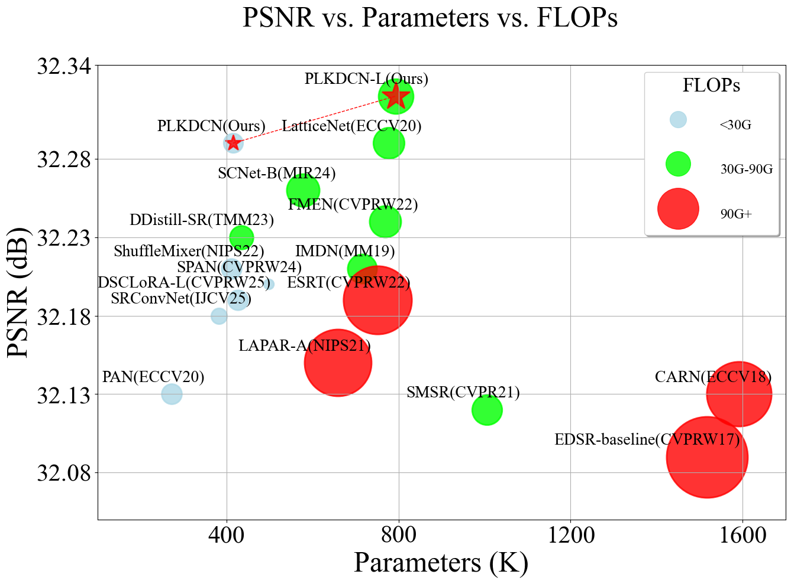
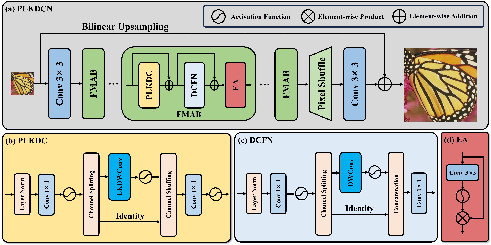
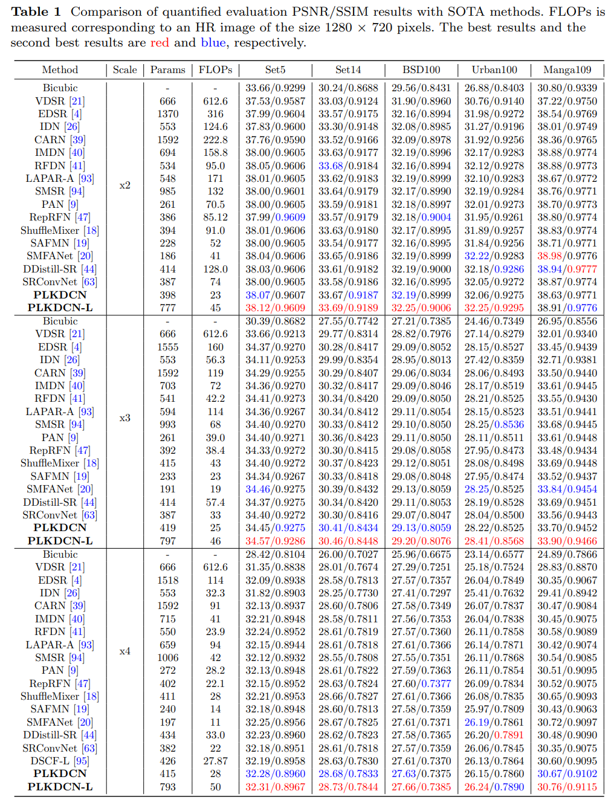
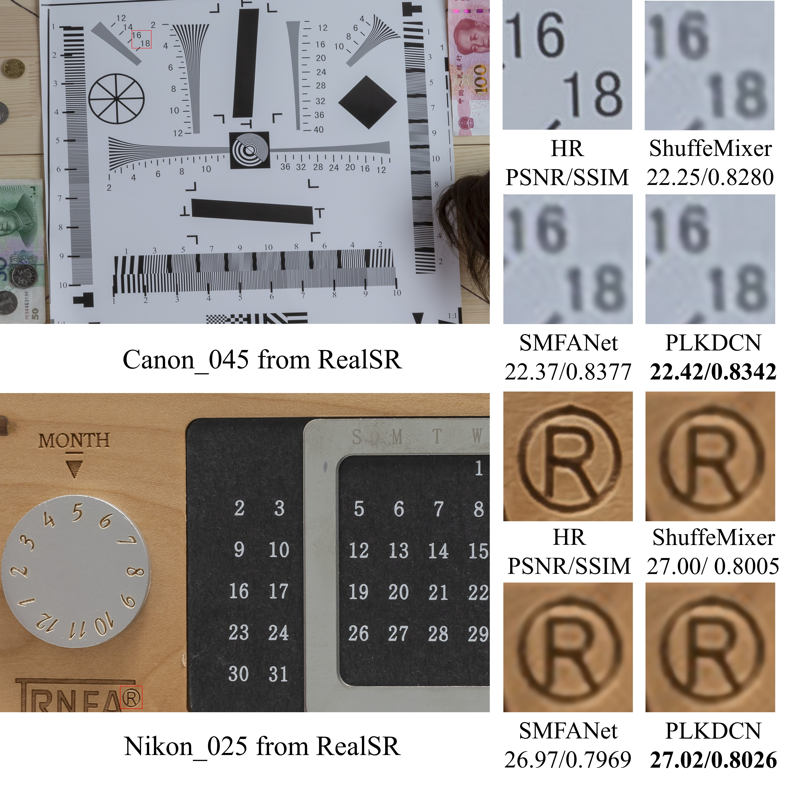

# Lightweight image super-resolution, Large kernel convolution, Depth-wise convolution, Partial convolution

### Abstract

Single image super-resolution (SISR) aims to reconstruct high-resolution images from low-resolution inputs, and lightweight models are essential for real-world deployment. Existing CNN and Transformer-based methods often struggle to balance performance and computational complexity, limiting their application on mobile devices. This work addresses this issue by proposing a partial large kernel depth-wise convolutional network (PLKDCN) for efficient lightweight super-resolution. The method integrates a feature modulation attention block composed of partial large kernel depth-wise convolution, depth-wise convolutional feedforward network, and element-wise attention to reduce computation while preserving fine details. Here we show that PLKDCN achieves 32.28 dB PSNR on Set5 for ×4 super-resolution with only 415K parameters, outperforming many state-of-the-art lightweight methods. The proposed design offers a practical solution for efficient image restoration and supports broader deployment in resource-constrained scenarios.



### Network architecture

ours_arch.py is the proposed PLKDCN:



### Installation
```python
git clone https://github.com/sxdyyds/PLKDCN.git
cd PLKDCN
conda create --name PLKDCN python=3.8
conda activate PLKDCN
pip install -r requirements.txt

# Install BasicSR
python setup.py develop
```
You can also refer to this [INSTALL.md](https://github.com/XPixelGroup/BasicSR/blob/master/docs/INSTALL.md) for installation

### Data Preparation

Please refer to: [BasicSR/docs/DatasetPreparation.md at master · XPixelGroup/BasicSR](https://github.com/XPixelGroup/BasicSR/blob/master/docs/DatasetPreparation.md).

### Training

- Run the following commands for training:
```python
python basicsr/train.py -opt options/train/Ours/train_DF2K_k9d64n5_x2.yml
python basicsr/train.py -opt options/train/Ours/train_DF2K_k9d64n5_x3.yml
python basicsr/train.py -opt options/train/Ours/train_DF2K_k9d64n5_x4.yml

# L
python basicsr/train.py -opt options/train/Ours/train_DF2K_k9d64n10_x2.yml
python basicsr/train.py -opt options/train/Ours/train_DF2K_k9d64n10_x3.yml
python basicsr/train.py -opt options/train/Ours/train_DF2K_k9d64n10_x4.yml
```

### Testing
- Download the pretrained models (pretrain_models_X.zip).
- Download the testing dataset.
- Run the following commands:
```python
python basicsr/test.py -opt options/test/Ours/test_DIV2K_k9d64n5_x2.yml
python basicsr/test.py -opt options/test/Ours/test_DIV2K_k9d64n5_x3.yml
python basicsr/test.py -opt options/test/Ours/test_DIV2K_k9d64n5_x4.yml

# L
python basicsr/test.py -opt options/test/Ours/test_DIV2K_k9d64n10_x2.yml
python basicsr/test.py -opt options/test/Ours/test_DIV2K_k9d64n10_x3.yml
python basicsr/test.py -opt options/test/Ours/test_DIV2K_k9d64n10_x4.yml
```
- The test results will be in './results'.

### Results

#### Quantitative Comparisons



#### Qualitative Comparisons

Benchmarks: 


RealSR:



## Citation

If you find this repository helpful, you may cite:

```tex

```

**Acknowledgment:** This code is based on the [BasicSR](https://github.com/xinntao/BasicSR) toolbox.
