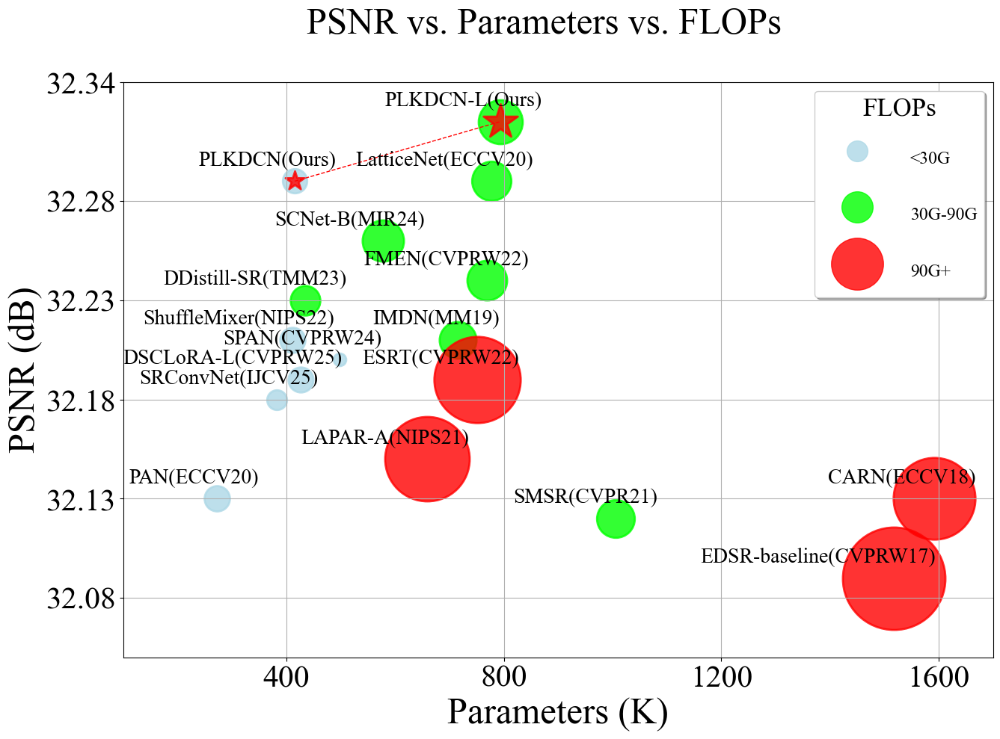
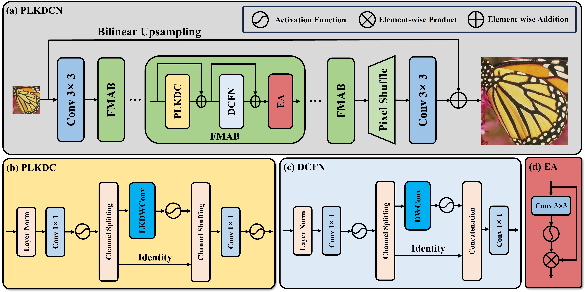
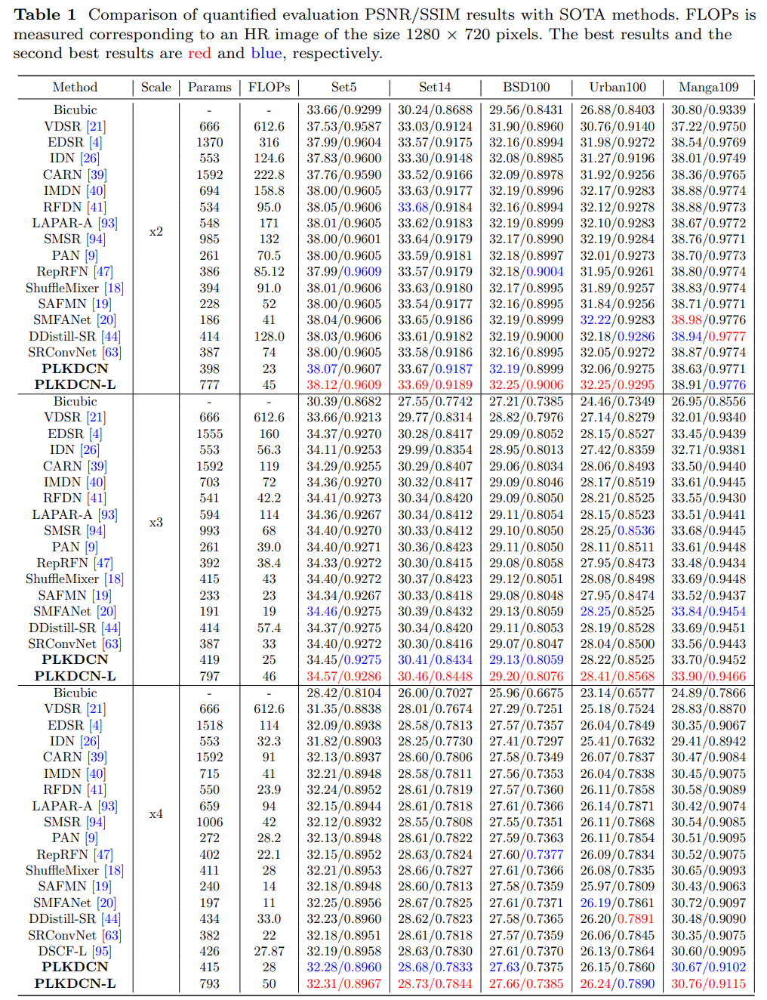
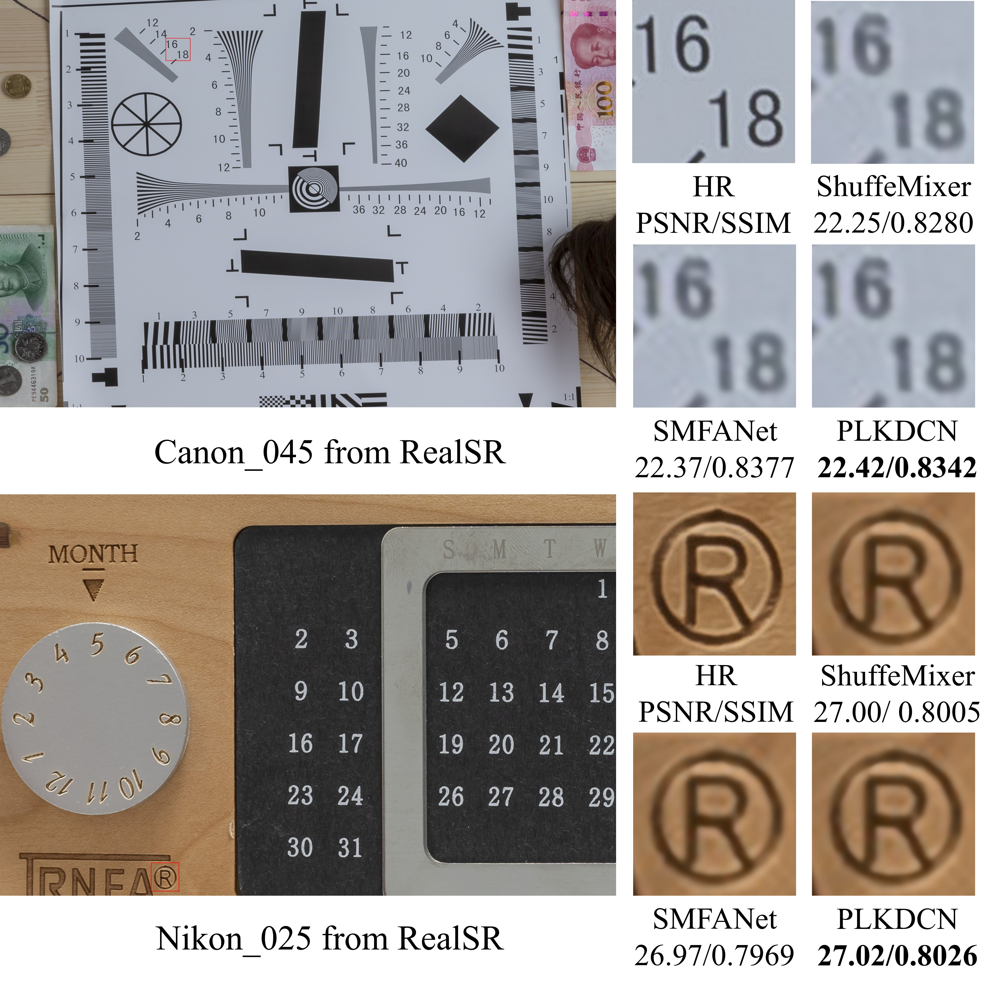

# Plkdcn: lightweight single-image super-resolution via partial large-kernel depthwise convolution

Paper Link: https://link.springer.com/article/10.1007/s00371-026-04742-1

### Abstract

Single image super-resolution (SISR) aims to reconstruct high-resolution images from low-resolution inputs, and lightweight models are essential for real-world deployment. Existing CNN and Transformer-based methods often struggle to balance performance and computational complexity, limiting their application on mobile devices. This work addresses this issue by proposing a partial large kernel depth-wise convolutional network (PLKDCN) for efficient lightweight super-resolution. The method integrates a feature modulation attention block composed of partial large kernel depth-wise convolution, depth-wise convolutional feedforward network, and element-wise attention to reduce computation while preserving fine details. Here we show that PLKDCN achieves 32.28 dB PSNR on Set5 for ×4 super-resolution with only 415K parameters, outperforming many state-of-the-art lightweight methods. The proposed design offers a practical solution for efficient image restoration and supports broader deployment in resource-constrained scenarios.



### Network architecture

ours_arch.py is the proposed PLKDCN:



### Installation
```python
git clone https://github.com/sxdyyds/PLKDCN.git
cd PLKDCN
conda create --name PLKDCN python=3.8
conda activate PLKDCN
pip install -r requirements.txt

# Install BasicSR
python setup.py develop
```
You can also refer to this [INSTALL.md](https://github.com/XPixelGroup/BasicSR/blob/master/docs/INSTALL.md) for installation

### Data Preparation

Please refer to: [BasicSR/docs/DatasetPreparation.md at master · XPixelGroup/BasicSR](https://github.com/XPixelGroup/BasicSR/blob/master/docs/DatasetPreparation.md).

### Training

- Run the following commands for training:
```python
python basicsr/train.py -opt options/train/Ours/train_DF2K_k9d64n5_x2.yml
python basicsr/train.py -opt options/train/Ours/train_DF2K_k9d64n5_x3.yml
python basicsr/train.py -opt options/train/Ours/train_DF2K_k9d64n5_x4.yml

# L
python basicsr/train.py -opt options/train/Ours/train_DF2K_k9d64n10_x2.yml
python basicsr/train.py -opt options/train/Ours/train_DF2K_k9d64n10_x3.yml
python basicsr/train.py -opt options/train/Ours/train_DF2K_k9d64n10_x4.yml
```

### Testing
- Download the pretrained models (pretrain_models_X.zip).
- Download the testing dataset.
- Run the following commands:
```python
python basicsr/test.py -opt options/test/Ours/test_DIV2K_k9d64n5_x2.yml
python basicsr/test.py -opt options/test/Ours/test_DIV2K_k9d64n5_x3.yml
python basicsr/test.py -opt options/test/Ours/test_DIV2K_k9d64n5_x4.yml

# L
python basicsr/test.py -opt options/test/Ours/test_DIV2K_k9d64n10_x2.yml
python basicsr/test.py -opt options/test/Ours/test_DIV2K_k9d64n10_x3.yml
python basicsr/test.py -opt options/test/Ours/test_DIV2K_k9d64n10_x4.yml
```
- The test results will be in './results'.

### Results

#### Quantitative Comparisons



#### Qualitative Comparisons

Benchmarks: 


RealSR:



## Citation

If you find this repository helpful, you may cite:

```tex
@Article{Cong2026,
author={Cong, Yizhi
and Wang, Baoting
and Guo, Hongyan
and Xu, Haixiao},
title={Plkdcn: lightweight single-image super-resolution via partial large-kernel depthwise convolution},
journal={The Visual Computer},
year={2026},
month={Sep},
day={23},
volume={42},
number={12},
pages={527},
abstract={Deep convolutional neural networks (CNNs) have demonstrated exceptional performance in single-image super-resolution (SISR) tasks due to their superior ability to capture local features. However, achieving satisfactory performance generally requires sufficient network depth and width, and performance tends to degrade when the network is overly simplistic. Although transformers capable of modeling long-range dependencies are also commonly employed in super-resolution tasks, they incur significantly higher computational costs. Consequently, balancing network complexity and performance merits careful consideration. To address these challenges, we propose a partial large-kernel depthwise convolutional network (PLKDCN) for lightweight image super-resolution. This approach integrates multiple lightweight techniques within the feature modulation attention block (FMAB), which contains three main modules: PLKDC, DCFN and EA. Specifically, we incorporate the notion of ``partial'' processing into the modules and employ depthwise convolution to reduce the computational load of the convolutional layers. The partial large-kernel depthwise convolution (PLKDC) module leverages partial convolutions to remove redundant information from feature maps by applying convolutions only to a subset of the input channels, while compensating for potential performance degradation induced by lightweighting with large-kernel depthwise convolutions. In addition, the depthwise convolutional feedforward network (DCFN) is designed to capture long-range dependencies, and element-wise attention (EA) is introduced to enhance high-frequency information, further boosting performance. Extensive experiments demonstrate that the proposed PLKDCN achieves a favorable accuracy-complexity trade-off against state-of-the-art lightweight SISR methods. For {\$}{\$}{\backslash}times {\$}{\$}4 super-resolution, the base PLKDCN model has only 415K parameters and 28 G FLOPs, with 16.5ms inference latency on an NVIDIA A40 GPU. Evaluations are conducted on five standard synthetic benchmarks and the real-world RealSR dataset, validating the effectiveness of the proposed design. The code and pre-trained models are available at https://github.com/sxdyyds/PLKDCN.},
issn={1432-2315},
doi={10.1007/s00371-026-04742-1},
url={https://doi.org/10.1007/s00371-026-04742-1}
}
```

**Acknowledgment:** This code is based on the [BasicSR](https://github.com/xinntao/BasicSR) toolbox.
